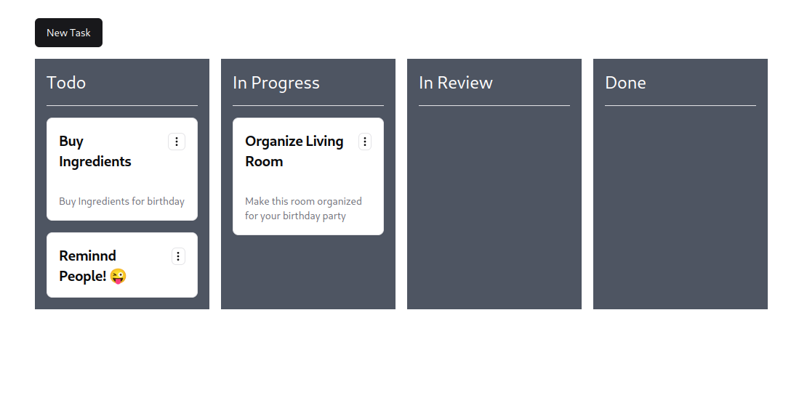
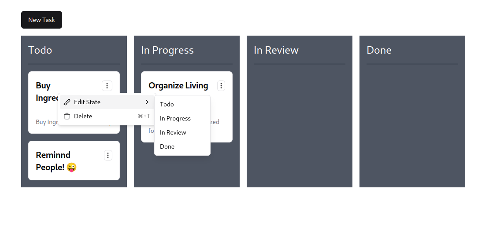
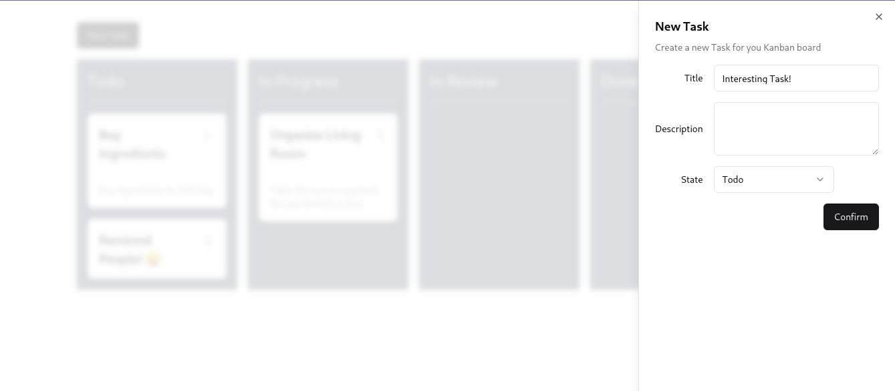

# Zustand Kanban Showcase

🚀 Check out the project running in this link:
https://zustand-kanban-showcase-felipeemos.vercel.app/

## What's this project?

This is a Kanban application I created to study the Zustand State Management Library

For the UI I'm using the awesome Library [ShadcnUI](https://ui.shadcn.com/)



Menus to change task state


Add New Task UI


## Running the project
Have installed the following software
- A browser
- pnpm
- Node ( I'm using version v18.0.0)
  - You can have something like 'nvm' which works great too, this project has a `.nvmrc` file to help you with that

```console
# Install Dependencies
pnpm i

# Run Local Server
pnpm dev
```

## To Improve
- Implement Drag And Drop for the Kanban
- Use React Hook Form for handling form state & validation
  - PRO TIP: ShadcnUI has an extensive documentation about this! Their solution is amazing and combines validation with the Zod library.

## FAQ

- Why I am using T3 Stack if I don't have a backend?
  - Because it's the fastest way to setup your React Typescript Tailwind project! 🙃
- In a real project with Backend, how should your state management go?
  - Zustand is meant to be used for managing Client State... your Backend state is the real source of truth and whenever possible you should go with React Query. Be mindful that React Query has a wonderful cache implementation and calling the same query in a lot of places in your app is not inefficient... it's meant to be that way. Also, in case you are using the T3 Stack, it's even better cus it's already set up for you with tRPC 🧑‍🍳 yummy!

## Stack
This is a [T3 Stack](https://create.t3.gg/) project bootstrapped with `create-t3-app`.

To learn more about the [T3 Stack](https://create.t3.gg/), take a look at the following resources:

- [Documentation](https://create.t3.gg/)
- [Learn the T3 Stack](https://create.t3.gg/en/faq#what-learning-resources-are-currently-available) — Check out these awesome tutorials

You can check out the [create-t3-app GitHub repository](https://github.com/t3-oss/create-t3-app) — your feedback and contributions are welcome!


## How do I deploy this?

Follow our deployment guides for [Vercel](https://create.t3.gg/en/deployment/vercel), [Netlify](https://create.t3.gg/en/deployment/netlify) and [Docker](https://create.t3.gg/en/deployment/docker) for more information.

# Final thoughts
I'd love to see if it's possible to make a good integration between Zustand and React Query client, maybe with a clever subscription to events, I don't know... let's be clear that this Kanban App doesn't need anything like that, the complexity here is low.

But I wonder how a more integrated solution Zustand + React Query could work in a more complex app I'm working on 🤔

The state management dilema is a pretty important one and the community is still figuring things out for sure. The great part about Zustand is that it's not opinionated! Once you understand how it works you feel free to go build your stuff 🙂, amazing DX indeed! I tried using Jotai previously but in the end I was reinventing Zustand in a bad way hahaha

So, the integration between Client State (Zustand) and Server State (or better said... the imperfect mirror of server state that is React Query) I'm wondering about should be made with a clear boundary of who affects who... maybe Zustand could just call the React Query client and handle mutations? who knows if that's a good idea.....


In the end I'm leaving this project with a great impression on Zustand! It abstracts in just the right way with much less boilerplate as something like Redux while still remainging a mega powerful tool! I hope this project inspires you to build your crazy ideais with Zustand or at least try the tool.